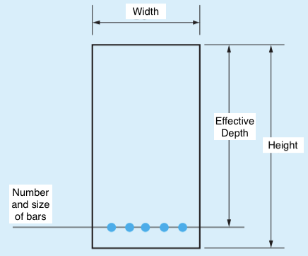
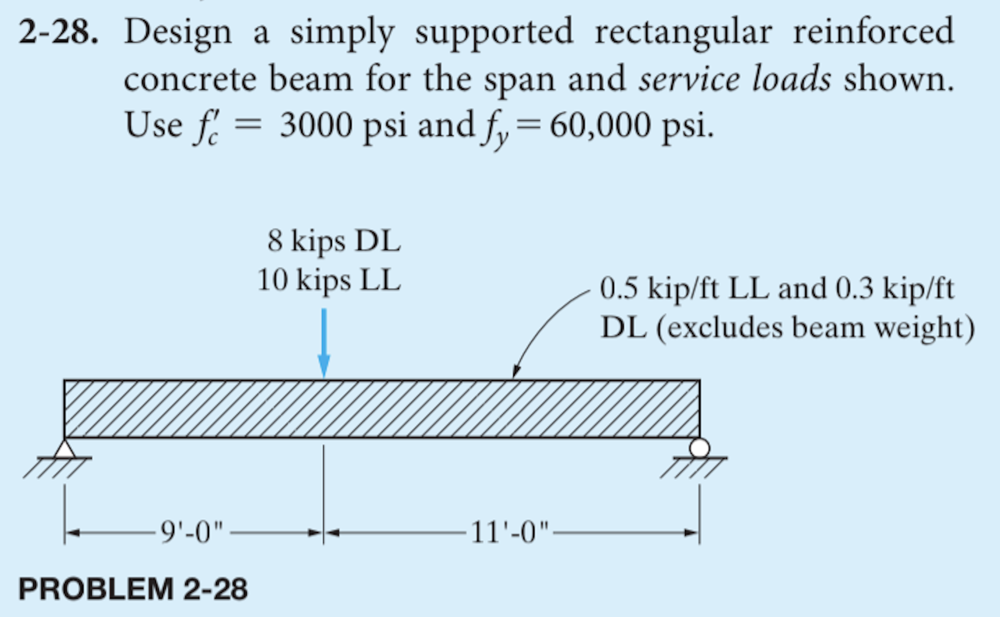

Reinforced Concrete Beam Design:
-------------
-------------

This is a program for reinforced concrete beam design.
The user inputs the compressive strength and yield strength of the concrete and steel,
along with the intended dead and live loads and load factors.
This program will return the beam dimensions (width, height, effective depth)
and the size and number of reinforcing steel bars required.

*Note: This program can only be used for point loads loaded at the same point of the beam and distributed loads that are applied across the entire length of the beam.*

Some things to be noted before running the program:

- All inputs are required.
- All values must be inputted without commas.
- The final output places the reinforcing bars at the bottom of the beam.
- Permitted values for concrete compressive strength in psi:
  3000, 4000, and 5000 (5000 only works with a yield strength of 60000)
- Permitted values for steel yield strength in psi:
  40000 and 60000
- **Only the above listed values for compressive strength and yield strength will run the program**

Inputs:
------

- Compressive strength of concrete (psi)
- Yield stress of steel (psi)
- Point dead load (kips)
- Point live load (kips)
- Distance from the left end of the beam to the point loads (feet)
- Length of entire beam (feet)
- Distributed dead load (kips/ft)
- Distributed live load (kips/ft)
- Load combination factors

Outputs:
------

- Beam height (inches)
- Beam width (inches)
- Beam effective depth (inches)
- Number of steel reinforcing bars
- Size of steel reinforcing bars

*Visualized output*

Example:
-----
The following is an example of the type of problem that can be solved using this program.

*Taken from Reinforced Concrete Design 9e textbook by Abi Aghayere*
